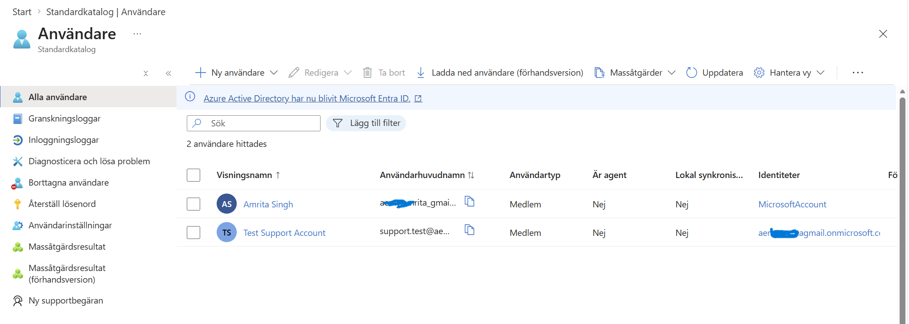
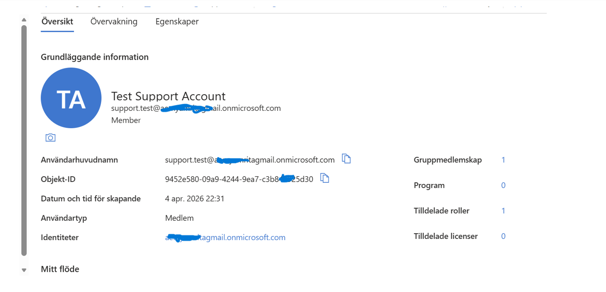
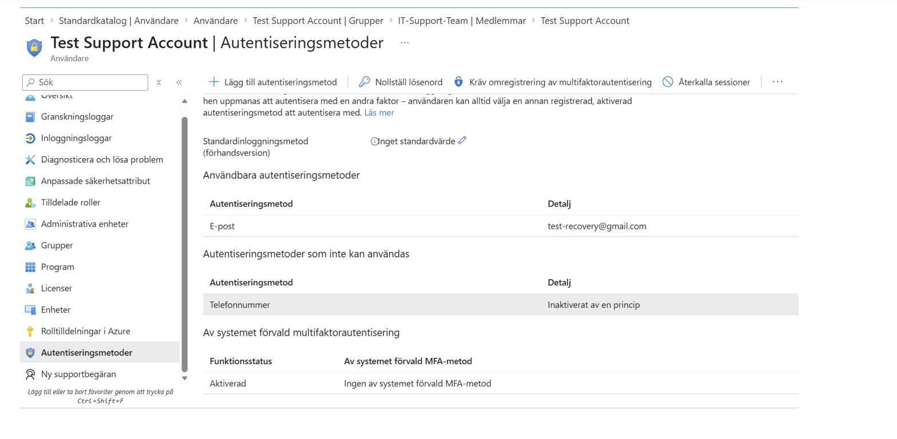
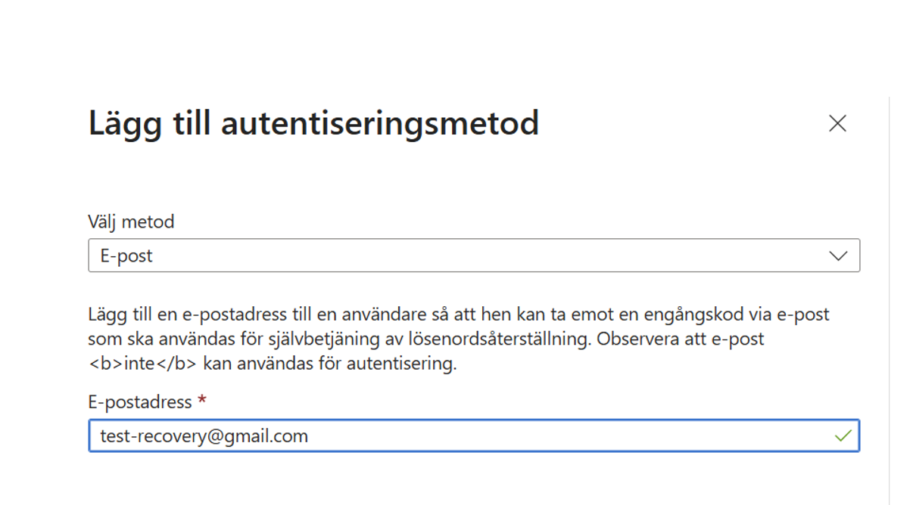
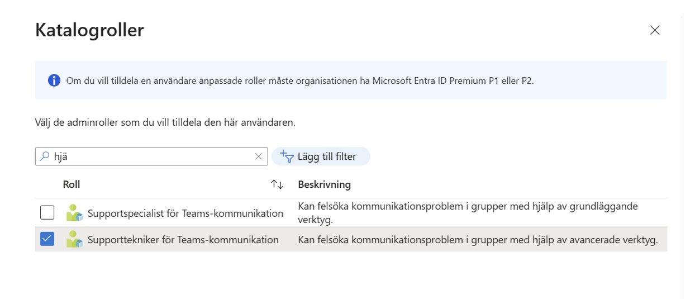
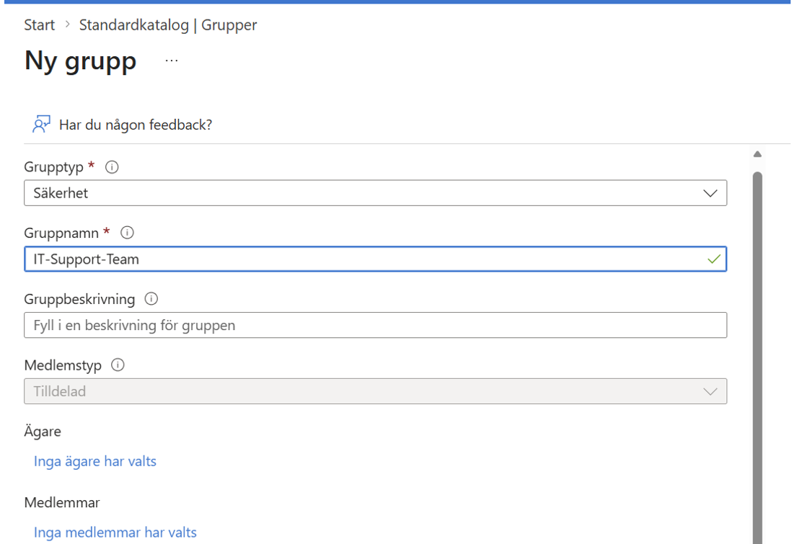
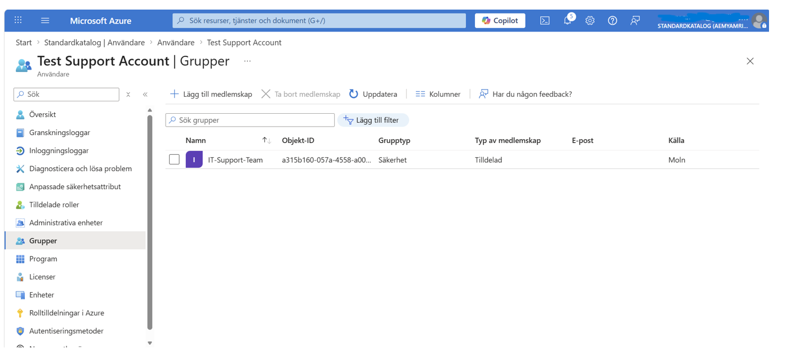
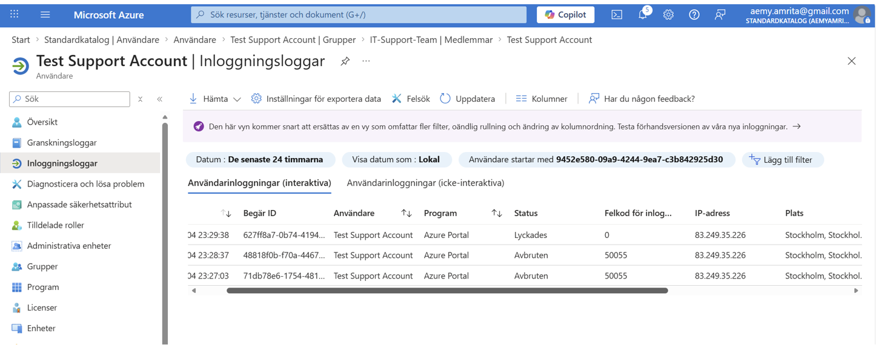

# Microsoft Entra ID: Identity Management & Security Lab

## Project Overview
This project documents the configuration of a Microsoft Entra ID (Azure AD) environment. The goal was to simulate a real-world enterprise scenario by managing the user lifecycle, implementing security hardening through MFA/SSPR, and applying Role-Based Access Control (RBAC).

## Phase 1: User Provisioning & Identity Management
**Objective:** Create and verify a cloud-only identity for a technical support role.
* Provisioned the `Test Support Account`.
* Audited identity attributes and Object ID to ensure proper administrative tracking.

## Phase 2: Security Hardening (MFA & SSPR)
**Objective:** Secure the tenant and reduce administrative overhead for password resets.
* Enforced Multi-Factor Authentication (MFA) and Self-Service Password Reset (SSPR).
* Registered a recovery email and phone number to provide account redundancy and resilience.

## Phase 3: RBAC & Scalable Group Infrastructure
**Objective:** Apply the "Principle of Least Privilege" and organize users into functional units.
* Assigned the **Teams Communications Support Engineer** role to limit access to necessary functions only.
* Built a Security Group named `IT-Support-Team` to demonstrate scalable permission management.

## Phase 4: Verification & Sign-in Auditing
**Objective:** Verify that security policies and permissions are functioning correctly.
* Analyzed the **Sign-in Logs** to confirm a successful authentication event.
* Verified the "Lyckades" (Success) status, confirming that the MFA challenge was passed and access was granted.

## Technical Skills Used
* **Directory Administration:** Identity lifecycle management in Entra ID.
* **Identity Security:** Configuration of MFA, SSPR, and authentication methods.
* **Access Control:** Role-Based Access Control (RBAC) and Security Group architecture.
* **Governance & Auditing:** Interpreting Sign-in and Audit logs for compliance.
